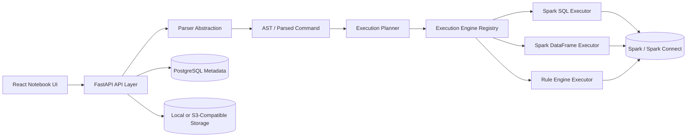
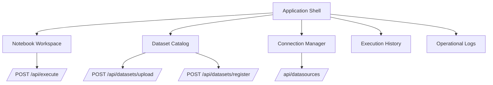
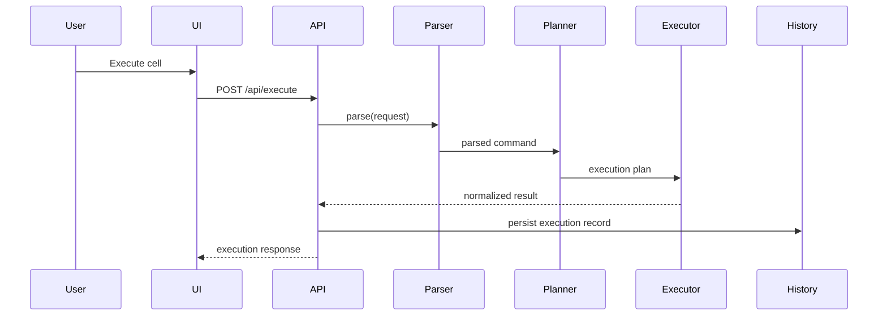

# Architecture Overview

Execution Workspace is designed around a generic execution pipeline so the editor remains stable while execution engines evolve.

## System Architecture

## Component View

## Execution Sequence

## Backend Modules

- `app/api`: HTTP routes and contract mapping
- `app/services/execution`: engine-agnostic execution pipeline and executors
- `app/services/storage`: dataset staging, preview, and metadata inference
- `app/services/datasources`: configured and runtime datasource inventory
- `app/models`: metadata persistence models
- `app/core`: config, logging, and security primitives

## Frontend Modules

- `components/layout`: shell and navigation
- `components/notebook`: notebook workspace and cell renderer
- `features/*/pages`: route-level screens for datasets, connections, history, logs, and settings
- `store/notebook-store.ts`: notebook cell state and orchestration
- `lib/api.ts`: shared API client

